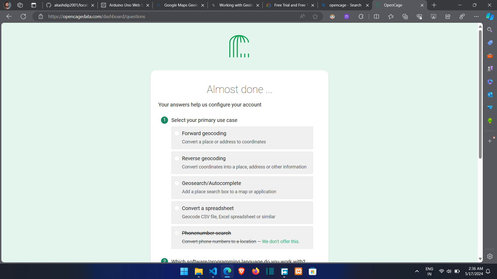
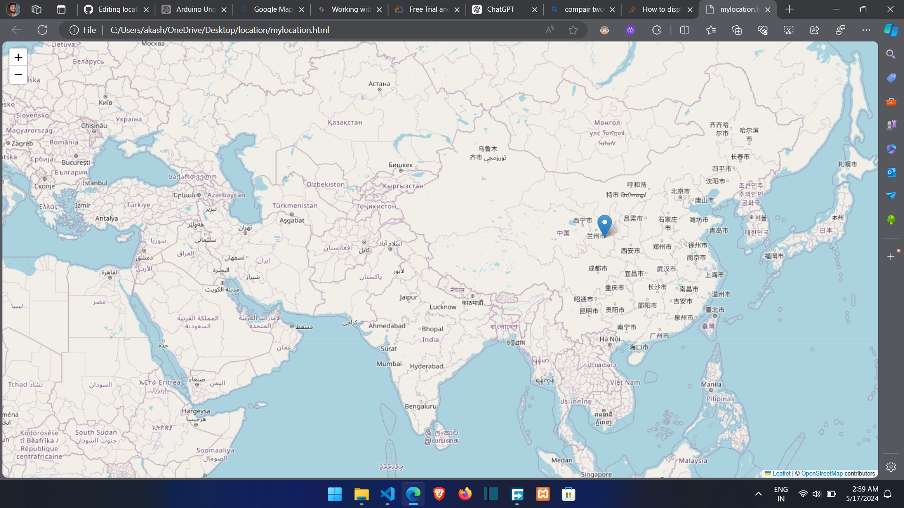

# location-py

# using Google Map API

If you have proper authorization and consent, you can use legitimate methods to track a device. Here's a simplified step-by-step process using Kali Linux:

1. **Install Required Tools**: Ensure you have the necessary tools installed on Kali Linux. You may need packages like `python`, `pip`, and libraries for geolocation services.
   
2. **Choose Geolocation Service**: Select a geolocation service API provider such as Google Maps Geolocation API, OpenCellID, or Mozilla Location Service.

3. **Get API Key (if needed)**: If the service requires an API key, sign up for an account and obtain the API key.

4. **Write Script**: Develop a Python script to interact with the chosen geolocation service. You can use libraries like `requests` to make HTTP requests and `json` to parse responses.

5. **Input Phone Number**: Prompt the user to input the phone number of the target device.

6. **Send Request**: Use the API to send a request with the phone number to the geolocation service.

7. **Process Response**: Handle the response from the service. Extract the location data if available.

8. **Display Results**: Present the location data to the user in a readable format.

Here's a basic example using Python and Google Maps Geolocation API:

```python
import requests
import json

# API endpoint and API key (replace with your own)
API_ENDPOINT = "https://www.googleapis.com/geolocation/v1/geolocate?key=YOUR_API_KEY"

def locate_device(phone_number):
    # Prepare JSON request data
    data = {
        "considerIp": "false",
        "phoneNumber": phone_number
    }

    # Send POST request to Google Maps Geolocation API
    response = requests.post(API_ENDPOINT, json=data)

    # Check if request was successful
    if response.status_code == 200:
        # Parse JSON response
        location_data = response.json()
        # Extract and display location data
        print("Device location:", location_data["location"])
    else:
        print("Failed to locate device. Status code:", response.status_code)

# Prompt user for phone number
phone_number = input("Enter phone number of the device to locate: ")

# Call function to locate device
locate_device(phone_number)
```

Remember to replace `"YOUR_API_KEY"` with your actual API key. Additionally, ensure you comply with the terms of service of the chosen geolocation service and any relevant privacy regulations.

# don't require an API key => using an open-source library called phonenumbers

In that case, you can explore alternative geolocation services that don't require an API key or registration. Here's a simplified example using an open-source library called `phonenumbers` in Python, which can provide basic information about phone numbers including country and carrier information:

```python
import phonenumbers

def locate_device(phone_number):
    try:
        # Parse the phone number
        parsed_number = phonenumbers.parse(phone_number, None)
        
        # Get country and carrier information
        country = phonenumbers.geocoder.description_for_number(parsed_number, "en")
        carrier = phonenumbers.carrier.name_for_number(parsed_number, "en")

        # Display information
        print("Country:", country)
        print("Carrier:", carrier)
    except Exception as e:
        print("Error:", e)

# Prompt user for phone number
phone_number = input("Enter phone number of the device to locate: ")

# Call function to get information about the phone number
locate_device(phone_number)
```

This script will provide you with information about the country and carrier associated with the provided phone number. While this doesn't give real-time location data, it can still be useful for your project. Remember to handle exceptions appropriately and ensure you comply with all applicable laws and ethical guidelines.

# using "OpenCelliD" project

One option for limited free access to geolocation services is the "OpenCelliD" project, which provides a database of cell tower locations worldwide. You can use this data for cell tower triangulation to estimate a device's location based on nearby towers.

Here's a simplified example of how you might use OpenCelliD in Python to perform cell tower triangulation:

```python
import requests

def locate_device(phone_number):
    try:
        # Placeholder for cell tower triangulation code
        # You'll need to implement the logic to calculate the device's location based on nearby cell towers
        
        # Example API request to OpenCelliD
        response = requests.get(f"https://opencellid.org/cell/get?key=YOUR_API_KEY&mcc=310&mnc=260&lac=100&cellid=512&format=json")
        
        if response.status_code == 200:
            location_data = response.json()
            # Extract and display location data
            print("Device location:", location_data["lat"], location_data["lon"])
        else:
            print("Failed to locate device. Status code:", response.status_code)
    except Exception as e:
        print("Error:", e)

# Prompt user for phone number
phone_number = input("Enter phone number of the device to locate: ")

# Call function to locate device
locate_device(phone_number)
```

Replace `"YOUR_API_KEY"` with your actual API key for OpenCelliD. Keep in mind that the accuracy of cell tower triangulation can vary, and this method may not provide precise pinpoint location data.

Additionally, remember to review OpenCelliD's terms of service and usage limits, as well as any applicable privacy regulations, before using their service.

[link](https://my.unwiredlabs.com/dashboard)

```
Request: 
2 WiFis, 1 Cell - {
    "token": "pk.78de4bfe360ad0f5a4d0ac303bc5546a",
    "radio": "gsm",
    "mcc": 310,
    "mnc": 404,
    "cells": [{
        "lac": 7033,
        "cid": 17811
    }],
    "wifi": [{
        "bssid": "00:17:c5:cd:ca:aa",
        "channel": 11,
        "frequency": 2412,
        "signal": -51
    }, {
        "bssid": "d8:97:ba:c2:f0:5a"
    }],
    "address": 1
}
```
```
Request: 
2 WiFis
{
    "token": "pk.78de4bfe360ad0f5a4d0ac303bc5546a",
    "wifi": [{
        "bssid": "00:17:c5:cd:ca:aa",
        "channel": 11,
        "frequency": 2412,
        "signal": -51
    }, {
        "bssid": "d8:97:ba:c2:f0:5a"
    }],
    "address": 1
}
```
```
Request: 
IP fallback
{
    "token": "pk.78de4bfe360ad0f5a4d0ac303bc5546a",
    "ip": "49.204.218.106",
    "fallbacks": {
        "ipf": "1"
    },
    "address": 1
}

```
```
Request: 
LAC fallback
{
    "token": "pk.78de4bfe360ad0f5a4d0ac303bc5546a",
    "cells": [{
        "radio": "gsm",
        "mcc": 310,
        "mnc": 404,
        "lac": 7011,
        "cid": 0
    }],
    "fallbacks": {
        "lacf": "2"
    },
    "address": 1
}
```
```
Request: 
SCF fallback
{
    "token": "pk.78de4bfe360ad0f5a4d0ac303bc5546a",
    "radio": "umts",
    "mcc": 310,
    "mnc": 404,
    "cells": [{
        "lac": 38996,
        "cid": 12814
    }],
    "address": 1,
    "fallbacks": {
        "scf": 1
    }
}
```
```
Request: 
PSC / PCI fallback
{
    "token": "pk.78de4bfe360ad0f5a4d0ac303bc5546a",
    "radio": "lte",
    "mcc": 310,
    "mnc": 404,
    "cells": [{
        "lac": 1,
        "cid": 5632016
    }, {
        "lac": 1,
        "psc": 221
    }],
    "address": 1
}

```
```
Request: 
1 Cell - GSM
{
    "token": "pk.78de4bfe360ad0f5a4d0ac303bc5546a",
    "radio": "gsm",
    "mcc": 310,
    "mnc": 404,
    "cells": [{
        "lac": 7033,
        "cid": 17811
    }],
    "address": 1
}
```
```
Request: 
1 Cell - CDMA
{
    "token": "pk.78de4bfe360ad0f5a4d0ac303bc5546a",
    "radio": "cdma",
    "mnc": 404,
    "cells": [{
        "lac": 7,
        "cid": 4864
    }],
    "address": 1
}

```
```
Request: 
1 Cell - UMTS
{
    "token": "pk.78de4bfe360ad0f5a4d0ac303bc5546a",
    "radio": "umts",
    "mcc": 310,
    "mnc": 404,
    "cells": [{
        "lac": 38996,
        "cid": 40907278,
        "psc": 0
    }],
    "address": 1
}

```
```
Request: 
1 Cell - LTE
{
    "token": "pk.78de4bfe360ad0f5a4d0ac303bc5546a",
    "radio": "lte",
    "mcc": 310,
    "mnc": 404,
    "cells": [{
        "lac": 1,
        "cid": 5632016,
        "psc": 0
    }],
    "address": 1
}

```
```
Request: 
1 Cell - Nb-IoT
{
    "token": "pk.78de4bfe360ad0f5a4d0ac303bc5546a",
    "radio": "nbiot",
    "mcc": 262,
    "mnc": 404,
    "cells": [{
        "lac": 42874,
        "cid": 5323111,
        "psc": 0
    }],
    "address": 1
}
```
```
Request: 
1 Cell - NR (5G)
{
    "token": "pk.78de4bfe360ad0f5a4d0ac303bc5546a",
    "radio": "nr",
    "mcc": 310,
    "mnc": 404,
    "cells": [{
        "lac": 7033,
        "cid": 56321809122,
        "psc": 0
    }],
    "address": 1
}

```
```
Request: 
6 Cells
{
    "token": "pk.78de4bfe360ad0f5a4d0ac303bc5546a",
    "radio": "gsm",
    "mcc": 310,
    "mnc": 404,
    "cells": [{
        "lac": 7033,
        "cid": 17811
    }, {
        "lac": 7033,
        "cid": 17812,
        "signal": -60
    }, {
        "lac": 7033,
        "cid": 18513
    }, {
        "lac": 7033,
        "cid": 16383
    }, {
        "lac": 7033,
        "cid": 12812
    }, {
        "lac": 7033,
        "cid": 12811
    }],
    "address": 1
}

```
```
Request: 
Multiple radios
{
    "token": "pk.78de4bfe360ad0f5a4d0ac303bc5546a",
    "radio": "gsm",
    "mcc": 310,
    "mnc": 404,
    "cells": [{
        "radio": "umts",
        "mcc": 310,
        "mnc": 404,
        "lac": 7033,
        "cid": 17811
    }, {
        "radio": "gsm",
        "mcc": 310,
        "mnc": 404,
        "lac": 7033,
        "cid": 17812,
        "signal": -60
    }],
    "address": 1
}

```
```
Request: 
Address with details
{
    "token": "pk.78de4bfe360ad0f5a4d0ac303bc5546a",
    "radio": "gsm",
    "mcc": 310,
    "mnc": 404,
    "cells": [{
        "lac": 7033,
        "cid": 17811
    }],
    "address": 2
}

```
```
Request: 
Per device plan
{
    "token": "pk.78de4bfe360ad0f5a4d0ac303bc5546a",
    "id": "Device_ID",
    "radio": "gsm",
    "mcc": 310,
    "mnc": 404,
    "cells": [{
        "lac": 7033,
        "cid": 17811
    }, {
        "lac": 7033,
        "cid": 17812,
        "signal": -60
    }, {
        "lac": 7033,
        "cid": 18513
    }, {
        "lac": 7033,
        "cid": 16383
    }, {
        "lac": 7033,
        "cid": 12812
    }, {
        "lac": 7033,
        "cid": 12811
    }],
    "address": 1
}

```
```
Request: 
Contribute GPS Positions
{
    "token": "pk.78de4bfe360ad0f5a4d0ac303bc5546a",
    "radio": "gsm",
    "mcc": 310,
    "mnc": 404,
    "cells": [{
        "lac": 7033,
        "cid": 17811,
        "timestamp": 1893456000000
    }],
    "wifi": [{
        "bssid": "00:17:c5:cd:ca:aa",
        "channel": 11,
        "frequency": 2412,
        "signal": -51,
        "timestamp": 1893456000000
    }, {
        "bssid": "d8:97:ba:c2:f0:5a",
        "timestamp": 1893456000000
    }],
    "gps": [{
        "source": "gps",
        "lat": 39.56764858,
        "lon": -105.0073312,
        "accuracy": 30.0,
        "altitude": 100.0,
        "altitude_accuracy": 50.0,
        "speed": 10.2,
        "heading": 35.5,
        "timestamp": 1893456000000
    }],
    "geolocation": 0,
    "metadata": 1,
    "address": 1
}
```

# Approximate Location

<h3>What about this apis ?<br> http://ip-api.com/json <br>
https://ip.nf/me.json<br>
https://ipapi.co/json<br>
https://geoip.tools/v1/json<br>
https://geolp.nekudo.com/api/<br> https://extreme-ip-lookup.com/json/<br>
http://www.geoplugin.net/json.gp<br>
https://ipinfo.io/json</h3>

These APIs you've listed are primarily for IP address geolocation, which means they provide information about the geographical location associated with an IP address rather than directly locating a mobile device by its phone number. While they can be useful for determining the general location of an IP address, they may not provide accurate or real-time data for pinpointing a mobile device's location.

However, if you have the ability to retrieve the IP address associated with the mobile device, you could use one of these APIs to obtain information about its approximate location based on the IP address. Here's an example of how you might use the ipinfo.io API in Python:

```python
import requests

def locate_device(ip_address):
    try:
        response = requests.get(f"https://ipinfo.io/{ip_address}/json")
        
        if response.status_code == 200:
            location_data = response.json()
            # Extract and display location data
            print("Device location:", location_data["loc"])
        else:
            print("Failed to locate device. Status code:", response.status_code)
    except Exception as e:
        print("Error:", e)

# Prompt user for IP address of the device
ip_address = input("Enter IP address of the device to locate: ")

# Call function to locate device
locate_device(ip_address)
```

Replace `"YOUR_API_KEY"` with your actual API key if required by the service. Keep in mind that IP-based geolocation may not always be accurate, especially for mobile devices accessing the internet through cellular networks or VPNs.



# using OpenCage Geocoding API ( not Work 📍)

<h3>Because Number-to-Location service not avalable Now</h3>
<br>
<br>
OpenCage Geocoding API is a geolocation service that provides limited free access with a daily quota of requests. Here's how you can use it to find the location of a mobile device based on its phone number using Python:

1. **Sign up for OpenCage API**: Register for a free account on the OpenCage website to obtain an API key.

2. **Install Required Libraries**: Install the `opencage` library using pip:

```bash
pip install opencage
```

3. **Write Script**: Develop a Python script to interact with the OpenCage Geocoding API.

```python
from opencage.geocoder import OpenCageGeocode
import phonenumbers

# Initialize OpenCageGeocode with your API key
api_key = 'YOUR_API_KEY'
geocoder = OpenCageGeocode(api_key)

def locate_device(phone_number):
    try:
        # Parse the phone number
        parsed_number = phonenumbers.parse(phone_number, None)
        country_code = phonenumbers.region_code_for_number(parsed_number)
        
        # Format phone number with country code
        formatted_number = phonenumbers.format_number(parsed_number, phonenumbers.PhoneNumberFormat.E164)

        # Geocode the phone number's country
        results = geocoder.geocode(country_code)

        if results and len(results):
            # Extract country's centroid coordinates
            country_lat = results[0]['geometry']['lat']
            country_lng = results[0]['geometry']['lng']

            # Geocode the formatted phone number
            number_results = geocoder.geocode(formatted_number)

            if number_results and len(number_results):
                # Extract phone number's location information
                location = number_results[0]['formatted']
                latitude = number_results[0]['geometry']['lat']
                longitude = number_results[0]['geometry']['lng']

                print("Phone Number Location:", location)
                print("Coordinates (Lat, Lng):", latitude, longitude)
            else:
                print("Location not found for the phone number.")
        else:
            print("Country not found for the phone number.")
    except Exception as e:
        print("Error:", e)

# Prompt user for phone number
phone_number = input("Enter phone number of the device to locate: ")

# Call function to get location information about the phone number
locate_device(phone_number)
```

Replace `'YOUR_API_KEY'` with your actual OpenCage API key. This script will geocode the provided phone number and display its location information, including the formatted address and coordinates.

Remember to handle exceptions appropriately and ensure you comply with OpenCage's usage policy and any applicable laws and regulations.

# updated OpenCage

creat two file `test.py` and `location.py` 

```python
# number = "+91 (750) 112-0412"
# number = "+91 (720) 397-2750"
# number = "+91 (707) 603-3011"
# number = "+1 (949) 666-0481"
number = "+861 (922) 374-1593"
# number = "+44 (749) 485-9645"
```

Run the code & Creat HTML file

<table>
<tr>
<th>Example 1</th>
<th>Example 2</th>
</tr>
<tr>
<td>
<pre>

import phonenumbers
from phonenumbers import geocoder 
from test import number
import folium

Key = "9aee7c78cd2c4ca2a5f02078ba497b19"

#number = input("Enter phone number with country code:")
check_number = phonenumbers.parse(number)
number_location = geocoder.description_for_number(check_number, "en")
print(number_location)


from phonenumbers import carrier 
service_provider = phonenumbers.parse(number)
print(carrier.name_for_number(service_provider, "en"))

from opencage.geocoder import OpenCageGeocode
geocoder = OpenCageGeocode(Key)

query = str(number_location)
results = geocoder.geocode(query)

lat = results[0]['geometry']['lat']
lng = results[0]['geometry']['lng']
print(lat,lng)

map_location = folium.Map(location = [lat,lng], zoom_start=9)
folium.Marker([lat,lng], popup=number_location).add_to(map_location)
map_location.save("mylocation.html")

</pre>
</td>
<td>

```python
import phonenumbers
from phonenumbers import geocoder, carrier
import folium
from opencage.geocoder import OpenCageGeocode
from test import number

Key = "9aee7c78cd2c4ca2a5f02078ba497b19"

# Assuming 'number' is correctly imported from the 'test' module
check_number = phonenumbers.parse(number)

# Retrieve location information
number_location = geocoder.description_for_number(check_number, "en")
print("Location:", number_location)

# Retrieve service provider information
service_provider = carrier.name_for_number(check_number, "en")
print("Service Provider:", service_provider)

# Geocoding the location
geocoder_obj = OpenCageGeocode(Key)
query = str(number_location)
results = geocoder_obj.geocode(query)

if results and len(results) > 0:
    lat = results[0]['geometry']['lat']
    lng = results[0]['geometry']['lng']
    print("Latitude:", lat, "Longitude:", lng)

    # Create HTML map
    map_location = folium.Map(location=[lat, lng], zoom_start=9)
    folium.Marker([lat, lng], popup=number_location).add_to(map_location)
    map_location.save("mylocation.html")
else:
    print("Location not found.")


```

</td>
</tr>
</table>


